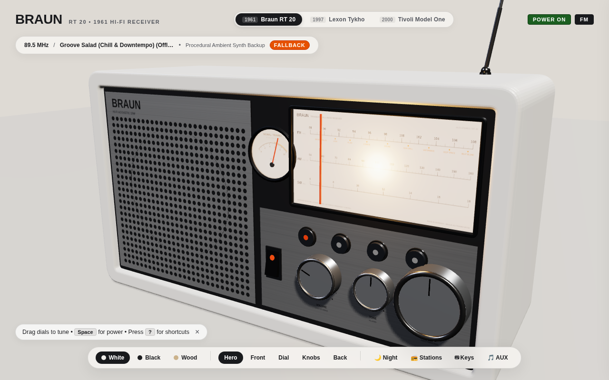
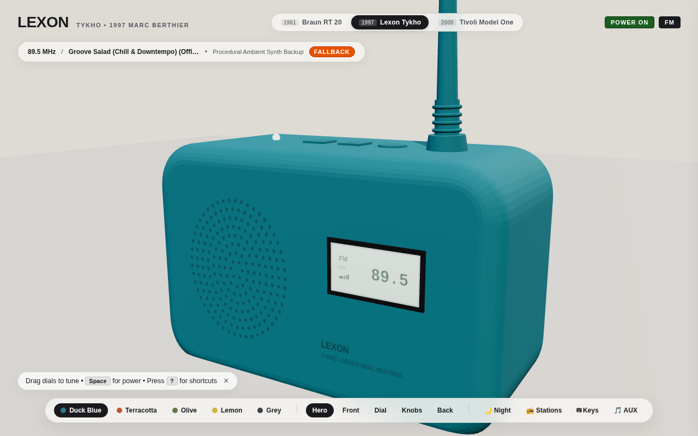
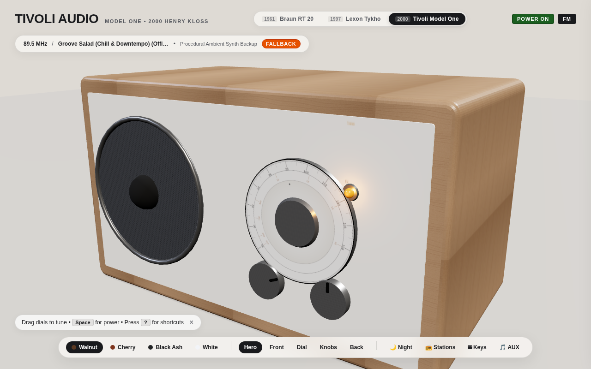

# ICONIC RADIOS — 3D Interactive Audio Player & Design Museum

> An interactive, museum-grade 3D web radio collection built with **Three.js** and the **Web Audio API**, celebrating milestone industrial designs from German functionalism and 1990s French pop to 2000s American neo-analog hi-fi.

**Live Site**: [https://braun-radio.pages.dev](https://braun-radio.pages.dev)

| 1961 • Braun RT 20 | 1997 • Lexon Tykho | 2000 • Tivoli Model One |
| :---: | :---: | :---: |
|  |  |  |

---

## 📻 The Iconic Radio Collection

Switch instantly between milestone radio designs directly in the browser or via keyboard (<kbd>X</kbd>):

### 1. Braun RT 20 (1961) — Dieter Rams & The Ulm School
* *"Weniger, aber besser"* — Less, but better.
* **The Masterpiece of German Functionalism**:
  * Architectural balance with warm matte white casing, brushed anodized aluminum faceplate, and blonde Scandinavian ash wood side cheeks.
  * Backlit frosted dial window with hairline cadmium-orange pointer needle and **150ms incandescent thermal rise simulation**.
  * Dynamic paper speaker cone vibrating to live bass frequencies.
  * Ballistic galvanometer VU / signal strength meter with spring damping.
  * Fluted cylindrical knurled dials and 4-stage telescopic chrome antenna.
  * **Chassis Themes**: Atelier White, Atelier Anthracite, RT 20 Wood & White.

### 2. Lexon Tykho (1997) — Marc Berthier
* *Permanent Collections: MoMA (New York), Centre Pompidou (Paris)*
* **The 1990s French Pop & Tactile Icon**:
  * Injection-molded seamless splashproof silicone elastomer rubber with velvety PBR response.
  * **Twist-the-Antenna Frequency Tuning**: Grab and twist the flexible rubber antenna directly in 3D to seek radio stations.
  * Recessed backlit digital LCD frequency matrix window displaying frequency, band, and signal bars.
  * Molded circular speaker dimples and embossed tactile membrane push-buttons (+ / - volume, power, and band).
  * **Colorways**: Signature Duck Blue, Terracotta, Olive Green, 1990s Lemon, Slate Grey.

### 3. Tivoli Audio Model One (2000) — Henry Kloss
* *The Benchmark of 21st-Century Neo-Analog Hi-Fi*
* **Warm Acoustic Wood & Planetary Geared Precision**:
  * Handcrafted furniture-grade wooden cabinet with inset cream/taupe, cobalt blue, or silver faceplates.
  * **5:1 Planetary Geared Tuning Dial**: Heavily geared reduction ratio with velvet rotational resistance for micro-fine tuning.
  * **Dynamic Amber Carrier-Locking Tuning LED**: Translucent diode that glows softly in static and brightens brilliantly with amber bloom when locking onto a station carrier.
  * Rear cylindrical bass-reflex acoustic port, 75Ω antenna F-connector, and metal acoustic grille.
  * **Cabinet Finishes**: Classic Walnut / Cream, Cherry / Cobalt Blue, Black Ash / Silver, Piano White.

---

## ✨ Audio Engine & RF Physics

- **Direct 24/7 Live Internet Streams**:
  - Live streams from **SomaFM** via unblocked Icecast connections (configured with `no-referrer` policy to bypass hotlink restrictions).
- **Realistic Superheterodyne Tuning Mechanics**:
  - Resonant bandpass-filtered pink and white atmospheric RF noise tracks dial position.
  - Superheterodyne heterodyne whistle sweeps in pitch toward zero-beat as you align with a carrier frequency.
  - Automatic Gain Control (AGC): Atmospheric static naturally subsides as signal strength peaks.
- **Resilient Procedural Synth Fallback**:
  - If network streaming drops or times out (>4.5s), the radio seamlessly transitions into warm generative analog drone chords and harmonic sweeps, ensuring an uninterrupted listening experience.
- **AUX / Line-In Mode**:
  - Switch to the `AUX` band and drag & drop any `.mp3`, `.wav`, `.flac`, or `.ogg` file onto the radio to play personal audio through the vintage speaker simulation!

---

## ⌨️ Universal Keyboard Shortcuts

Operate the entire collection using the keyboard:

| Key | Action | Description |
| :--- | :--- | :--- |
| <kbd>Space</kbd> | **Power** | Toggle receiver power on / standby |
| <kbd>X</kbd> | **Cycle Radio** | Switch between Braun RT 20, Lexon Tykho, and Tivoli Model One |
| <kbd>←</kbd> / <kbd>→</kbd> | **Tune Down / Up** | Fine frequency adjustment (0.1 MHz / 5 kHz) |
| <kbd>Shift</kbd> + <kbd>←</kbd> / <kbd>→</kbd> | **Coarse Tune** | Fast frequency sweep (1.0 MHz / 50 kHz) |
| <kbd>↑</kbd> / <kbd>↓</kbd> | **Volume Up / Down** | Adjust audio output level (5% increments) |
| <kbd>1</kbd> | **FM Band** | Switch to FM (87.5 – 108.0 MHz) |
| <kbd>2</kbd> | **AM Band** | Switch to Medium Wave AM (520 – 1610 kHz) |
| <kbd>3</kbd> | **SW Band** | Switch to Shortwave (5.9 – 15.5 MHz) |
| <kbd>4</kbd> | **AUX Band** | Switch to AUX / Line-In mode |
| <kbd>M</kbd> | **Mute** | Mute or restore audio output |
| <kbd>V</kbd> | **Cycle View** | Cycle camera: Hero → Front → Dial → Knobs → Back |
| <kbd>N</kbd> | **Night Mode** | Toggle Twilight Night mode / Studio Day mode |
| <kbd>S</kbd> | **Stations** | Open / close Stations Drawer |
| <kbd>?</kbd> | **Help** | Open Keyboard Shortcuts modal |
| <kbd>Esc</kbd> | **Dismiss** | Close active modal or drawer |

---

## 📻 Station Guide

### FM Band (Chill, Downtempo & Ambient)
| Frequency | Station | Description |
| :--- | :--- | :--- |
| `89.5 MHz` | **Groove Salad** | The classic ambient / downtempo beats channel |
| `91.5 MHz` | **Lush** | Sensuous, mellow vocal chillout & downtempo |
| `93.5 MHz` | **Fluid** | Soulful chill hip-hop, future soul & lofi beats |
| `95.7 MHz` | **Ill Street Lounge** | Classic bachelor pad exotica & vintage lounge |
| `98.3 MHz` | **Drone Zone** | Deep atmospheric space ambient chill |
| `100.8 MHz` | **Suburbs of Goa** | Asian ambient chill & world beats |
| `103.2 MHz` | **Vaporwaves** | Dreamy vaporwave, chillwave & nostalgic synth |
| `105.5 MHz` | **Deep Space One** | Deep space ambient electronic chill |
| `107.5 MHz` | **Beat Blender** | Late-night deep chill house & grooves |

### AM Band (Vintage Lounge, Roots & Folk)
| Frequency | Station | Description |
| :--- | :--- | :--- |
| `600 kHz` | **Secret Agent** | 1960s spy jazz, film noir & surf lounge |
| `820 kHz` | **Boot Liquor** | Vintage Americana, roots & acoustic chill |
| `1050 kHz` | **Folk Forward** | Indie & traditional acoustic folk chill |
| `1340 kHz` | **Groove Salad Classic** | Heritage early 2000s downtempo chill |

### SW Band (Shortwave Space, Scanner & Cyber)
| Frequency | Station | Description |
| :--- | :--- | :--- |
| `7.25 MHz` | **Mission Control** | Space ambient mixed with live NASA astronaut audio |
| `9.49 MHz` | **SF 10-33** | Ambient electronic mixed with live emergency scanner |
| `11.85 MHz` | **DEF CON Radio** | Cyber electronics & dark hacker ambient |
| `14.20 MHz` | **Synphaera** | Modern ambient synthscapes & spacemusic |

---

## 🚀 Getting Started

### Prerequisites
- [Node.js](https://nodejs.org/) (v18 or higher recommended)
- [npm](https://www.npmjs.com/)

### Installation
```bash
# Clone the repository
git clone https://github.com/acchuang/braun-radio.git

# Navigate to project directory
cd braun-radio

# Install dependencies
npm install
```

### Running Locally
```bash
npm run dev
```
Open [http://localhost:5173](http://localhost:5173) in your browser.

### Building for Production
```bash
npm run build
npm run preview
```

---

## 🔗 Deep-Link URL Parameters

Configure the initial model, camera angle, lighting, theme, or power state directly through URL search parameters:

| Parameter | Values | Description |
| :--- | :--- | :--- |
| `model` | `braun`, `lexon`, `tivoli` | Active 3D radio design |
| `theme` | Per-model themes | Chassis finish (`wood`, `duck-blue`, `walnut`, etc.) |
| `view` | `hero`, `front`, `dial`, `controls`, `back` | Initial camera focal point |
| `night` | `true`, `1` | Start in Twilight Night mode |
| `power` | `on`, `1` | Start with radio powered on |
| `drawer` | `open`, `1` | Start with Stations Drawer opened |

**Quick Links:**
- [Live Radio Collection](https://braun-radio.pages.dev)
- [Lexon Tykho (Duck Blue, Powered On)](https://braun-radio.pages.dev/?model=lexon&power=on)
- [Tivoli Model One (Walnut, Dial Close-up)](https://braun-radio.pages.dev/?model=tivoli&view=dial&power=on)
- [Braun RT 20 (Wood Edition, Twilight Night)](https://braun-radio.pages.dev/?model=braun&theme=wood&night=true&power=on)

---

## 📐 Architecture & Modules

```
braun-radio/
├── index.html            # Semantic HTML shell, model switcher tabs, HUD ticker, shortcuts modal
├── src/
│   ├── main.js           # Multi-model scene orchestrator, studio lighting, URL parameters, render loop
│   ├── models/
│   │   ├── BaseRadio.js       # Abstract base class / interface contract for all radio models
│   │   ├── BraunRT20.js       # 1961 Braun RT 20: vibrating cone, illuminated dial window, VU meter
│   │   ├── LexonTykho.js      # 1997 Lexon Tykho: silicone PBR, twist-antenna tuner, backlit LCD
│   │   ├── TivoliModelOne.js  # 2000 Tivoli Model One: 5:1 planetary dial, dynamic amber LED, wood cabinet
│   │   └── index.js           # Radio model registry and factory definitions
│   ├── audioEngine.js    # Web Audio graph: Icecast streaming, RF filters, heterodyne whistle, synth fallback
│   ├── interaction.js    # Multi-model raycasting, true angular knob dragging, 5:1 planetary gear, tooltips
│   ├── textures.js       # Procedural canvas textures: dial scales, perforated mesh, wood grains, LCD matrix
│   └── style.css         # Minimalist typography, model tabs, quiet ticker, shortcuts modal, night mode
├── dist/                 # Production build output
└── package.json          # Dependencies (Three.js, Vite)
```

---

## 📜 Design Principles

This project is guided by Dieter Rams’s **Ten Principles of Good Design**:
1. **Good design is innovative** — Modern 3D WebGL and Web Audio API recreating analog physics.
2. **Good design makes a product useful** — A functioning 24/7 chillout radio receiver for work, focus, or relaxation.
3. **Good design is aesthetic** — Faithful proportions, authentic materials, and subtle lighting.
4. **Good design makes a product understandable** — Intuitive physical dials and affordances that explain their own function.
5. **Good design is unobtrusive** — Whisper-quiet UI that gets out of the way; zero banner clutter or flashy popups.
6. **Good design is honest** — Materials look like what they are: anodized aluminum, silicone rubber, walnut, and illuminated glass.
7. **Good design is long-lasting** — Celebrating designs spanning 1961 to 2000 that remain timeless.
8. **Good design is thorough down to the last detail** — Thermal lamp curves, 5:1 planetary gear ratios, and antenna twist physics.
9. **Good design is environmentally friendly** — Lightweight, tree-shaken static web bundle with efficient GPU memory usage.
10. **Good design is as little design as possible** — *"Weniger, aber besser"*.

---

## 🎧 Acknowledgments

- **Dieter Rams**, **Marc Berthier**, and **Henry Kloss** for defining the golden eras of audio industrial design.
- **[SomaFM](https://somafm.com/)** for providing commercial-free, listener-supported internet radio since 2000. Please consider [supporting SomaFM](https://somafm.com/support/).
- **Three.js** team and contributors for the WebGL 3D engine.

---

## 📄 License

MIT License. See [LICENSE](LICENSE) for details.
