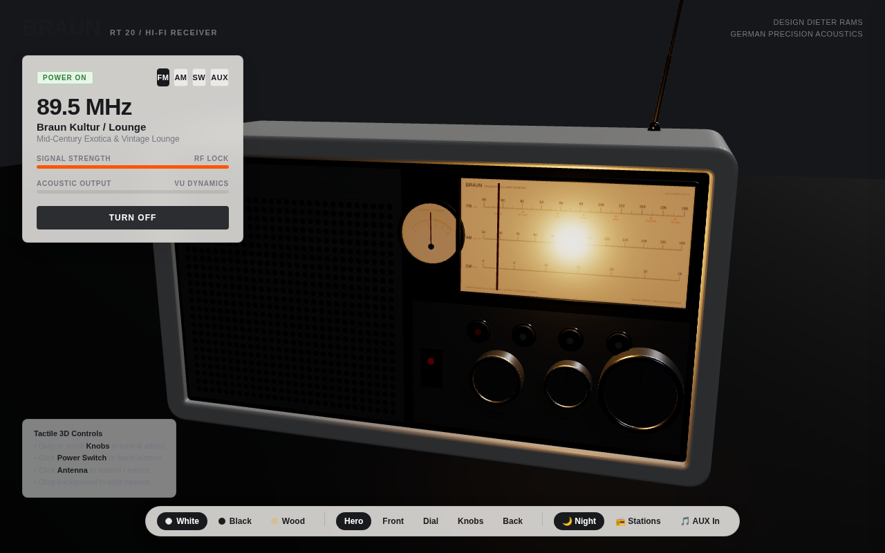
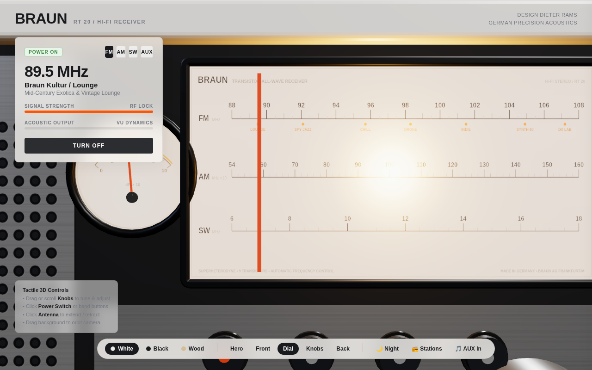

# BRAUN RT 20 — 3D Interactive Radio Receiver

> *"Weniger, aber besser"* — Less, but better.  
> An interactive, high-fidelity 3D web radio receiver built with **Three.js** and the **Web Audio API**, paying homage to **Dieter Rams** and the iconic 1961 Braun / Ulm School of Design philosophy.


---

## 📻 Overview

The **Braun RT 20 Tischsuper** (table radio), originally designed in 1961 by **Dieter Rams**, is one of the definitive benchmarks of 20th-century industrial design. Characterized by its unadorned architectural symmetry, blonde wood side cheeks, brushed aluminum faceplate, and intuitive rotary controls, it established a visual syntax that continues to influence consumer electronics today.

This project recreates the RT 20 as a fully interactive, physically modelled 3D receiver in the browser. It combines real-time WebGL rendering, true angular rotary kinematics, realistic superheterodyne RF radio physics, and live 24/7 internet radio stations with zero external plugins.

---

## ✨ Features & Craftsmanship

### 1. Authentic Industrial Design
- **Three Historical Editions**:
  - **RT 20 Wood & White (1961)**: Classic blonde Scandinavian ash wood side cheeks with subtle growth rings and warm matte white chassis.
  - **Atelier White**: Pure matte off-white casing, anodized aluminum faceplate, and signature cadmium-orange tuning accents.
  - **Atelier Anthracite**: Deep matte graphite casing with dark gunmetal panels and contrasting white typography.
- **Physical Modeling & Real-Time Details**:
  - **Perforated Speaker Grille**: Full-coverage micro-perforations with dark acoustic backing cloth and the vintage *BRAUN* typographic emblem.
  - **Dynamic Speaker Cone**: Physically vibrating 3D paper cone and dust cap driven in real time by Web Audio sub-bass frequencies.
  - **Illuminated Dial Window**: Frosted frequency scale with an authentic cadmium-orange pointer needle and incandescent dial lamp with **150ms thermal inertia simulation** (soft rise and decay).
  - **Ballistic Galvanometer / VU Meter**: Functional analog signal meter needle with calibrated spring-damping reacting to RF signal strength and audio levels.
  - **Knurled Aluminum Knobs**: Tactile fluted cylindrical dials with polished chamfered rims and hairline index notches.
  - **Rear Cabinet Details**: Perforated heat dissipation louvers, chassis serial badge, external dipole antenna terminals, and vintage German DIN specification plate.

---

### 2. Physical & Tactile 3D Kinematics
- **True Angular Knob Dragging**: Rotary dials calculate angular displacement around the knob center (`Math.atan2()`), delivering a natural twisting motion rather than artificial linear dragging.
- **Acoustic Feedback**:
  - Transformer low-frequency power-on thump.
  - Mechanical push-button latching clicks for waveband selectors (`FM`, `AM`, `SW`, `AUX`).
  - Tactile detent tick sounds when rotating volume and tone knobs.
- **Telescopic Chrome Antenna**: 4-stage extendable antenna. Retracting the antenna attenuates signal reception and introduces realistic atmospheric RF noise.
- **Cinematic Camera Transitions**: Smooth interpolated focal transitions between **Hero (3/4)**, **Front**, **Dial Close-up**, **Knobs**, and **Rear Service Panel**.
- **Studio Day & Twilight Night Modes**: In Night Mode, ambient room light dims into a warm evening atmosphere, highlighting the incandescent dial lamp casting an amber glow across the faceplate.

| Twilight Night Mode | Dial Scale & Warm Illumination |
| :---: | :---: |
|  |  |

---

### 3. Whisper-Quiet, Distilled Interface
Adhering to Dieter Rams's principle that *"Good design is unobtrusive"*, the interface avoids noisy on-screen HUDs:
- **Whisper Ticker**: A quiet, minimalist status ticker at the bottom-center that indicates station name, frequency, genre, and streaming bitrate without distracting from the physical object.
- **Collapsible Preset Drawer**: Quick access to all stations and live signal strength meters via the <kbd>S</kbd> key or drawer toggle.
- **Dismissible Onboarding**: Non-intrusive hint explaining physical knob interaction, persisting state to `localStorage`.
- **Keyboard Shortcuts Modal**: Accessible at any time via <kbd>?</kbd>.
- **Screen Reader Accessibility**: Built-in `#aria-status` live region announcing band switches, tuning frequency, power state, and volume levels.

---

### 4. RF Physics & Audio Engine
- **Direct 24/7 Live Internet Streams**:
  - Streamed directly from **SomaFM** via unblocked Icecast connections (using `no-referrer` policy to prevent hotlink blocks).
- **Realistic Superheterodyne Tuning Mechanics**:
  - Resonant bandpass-filtered pink and white atmospheric noise tracks the dial position.
  - Superheterodyne heterodyne whistle sweeps in pitch toward zero-beat as you align with a carrier frequency.
  - Automatic Gain Control (AGC): Atmospheric static naturally subsides as signal strength peaks.
- **Resilient Procedural Synth Fallback**:
  - If network streaming drops or times out (>4.5s), the radio seamlessly cross-fades into warm generative analog drone chords and harmonic sweeps, ensuring an uninterrupted listening experience.
- **AUX / Line-In Mode**:
  - Switch to the `AUX` band and drag & drop any `.mp3`, `.wav`, `.flac`, or `.ogg` file onto the radio to play personal audio through the vintage speaker simulation!

---

## ⌨️ Keyboard Shortcuts

The radio can be operated entirely via keyboard:

| Key | Action | Description |
| :--- | :--- | :--- |
| <kbd>Space</kbd> | **Power** | Toggle receiver power on / off |
| <kbd>←</kbd> / <kbd>→</kbd> | **Tune Down / Up** | Fine frequency adjustment (0.1 MHz / 5 kHz) |
| <kbd>Shift</kbd> + <kbd>←</kbd> / <kbd>→</kbd> | **Coarse Tune** | Fast frequency sweep (1.0 MHz / 50 kHz) |
| <kbd>↑</kbd> / <kbd>↓</kbd> | **Volume Up / Down** | Adjust audio output level (5% increments) |
| <kbd>1</kbd> | **FM Band** | Switch to FM (87.5 – 108.0 MHz) |
| <kbd>2</kbd> | **AM Band** | Switch to Medium Wave AM (520 – 1610 kHz) |
| <kbd>3</kbd> | **SW Band** | Switch to Shortwave (5.9 – 15.5 MHz) |
| <kbd>4</kbd> | **AUX Band** | Switch to AUX / Line-In mode |
| <kbd>M</kbd> | **Mute** | Mute or restore audio output |
| <kbd>V</kbd> | **Cycle View** | Cycle camera: Hero → Front → Dial → Knobs → Back |
| <kbd>N</kbd> | **Night Mode** | Toggle Twilight Night mode / Studio Day mode |
| <kbd>S</kbd> | **Stations** | Open / close Stations Drawer |
| <kbd>?</kbd> | **Help** | Open Keyboard Shortcuts modal |
| <kbd>Esc</kbd> | **Dismiss** | Close active modal or drawer |

---

## 📻 Station Guide

### FM Band (Chill, Downtempo & Ambient)
| Frequency | Station | Description |
| :--- | :--- | :--- |
| `89.5 MHz` | **Groove Salad** | The classic ambient / downtempo beats channel |
| `91.5 MHz` | **Lush** | Sensuous, mellow vocal chillout & downtempo |
| `93.5 MHz` | **Fluid** | Soulful chill hip-hop, future soul & lofi beats |
| `95.7 MHz` | **Ill Street Lounge** | Classic bachelor pad exotica & vintage lounge |
| `98.3 MHz` | **Drone Zone** | Deep atmospheric space ambient chill |
| `100.8 MHz` | **Suburbs of Goa** | Asian ambient chill & world beats |
| `103.2 MHz` | **Vaporwaves** | Dreamy vaporwave, chillwave & nostalgic synth |
| `105.5 MHz` | **Deep Space One** | Deep space ambient electronic chill |
| `107.5 MHz` | **Beat Blender** | Late-night deep chill house & grooves |

### AM Band (Vintage Lounge, Roots & Folk)
| Frequency | Station | Description |
| :--- | :--- | :--- |
| `600 kHz` | **Secret Agent** | 1960s spy jazz, film noir & surf lounge |
| `820 kHz` | **Boot Liquor** | Vintage Americana, roots & acoustic chill |
| `1050 kHz` | **Folk Forward** | Indie & traditional acoustic folk chill |
| `1340 kHz` | **Groove Salad Classic** | Heritage early 2000s downtempo chill |

### SW Band (Shortwave Space, Scanner & Cyber)
| Frequency | Station | Description |
| :--- | :--- | :--- |
| `7.25 MHz` | **Mission Control** | Space ambient mixed with live NASA astronaut audio |
| `9.49 MHz` | **SF 10-33** | Ambient electronic mixed with live emergency scanner |
| `11.85 MHz` | **DEF CON Radio** | Cyber electronics & dark hacker ambient |
| `14.20 MHz` | **Synphaera** | Modern ambient synthscapes & spacemusic |

---

## 🚀 Getting Started

### Prerequisites
- [Node.js](https://nodejs.org/) (v18 or higher recommended)
- [npm](https://www.npmjs.com/)

### Installation
```bash
# Clone the repository
git clone https://github.com/acchuang/braun-radio.git

# Navigate to project directory
cd braun-radio

# Install dependencies
npm install
```

### Running Locally
```bash
npm run dev
```
Open [http://localhost:5173](http://localhost:5173) in your browser.

### Building for Production
```bash
npm run build
npm run preview
```
The compiled, tree-shaken static assets will be output to the `dist/` directory.

---

## 🔗 Deep-Link URL Parameters

Configure the initial camera angle, lighting, theme, or power state directly through URL search parameters:

| Parameter | Values | Description |
| :--- | :--- | :--- |
| `theme` | `wood`, `white`, `black` | Chassis finish (RT 20 Wood, Atelier White, Atelier Anthracite) |
| `view` | `hero`, `front`, `dial`, `controls`, `back` | Initial camera focal point |
| `night` | `true`, `1` | Start in Twilight Night mode with dial lamp illuminated |
| `power` | `on`, `1` | Start with radio powered on |
| `drawer` | `open`, `1` | Start with Stations Drawer opened |

**Quick Links:**
- [Night Close-Up of Dial](http://localhost:5173/?view=dial&power=on&night=true)
- [RT 20 Wood Edition (Powered On)](http://localhost:5173/?theme=wood&power=on)
- [Rear Specification & Louver View](http://localhost:5173/?view=back)

---

## 📐 Architecture & Modules

```
braun-radio/
├── index.html          # Semantic HTML shell, viewport meta, HUD ticker, and shortcuts modal
├── src/
│   ├── main.js         # Three.js scene setup, PBR studio lighting, render loop, event orchestration
│   ├── radioModel.js   # 3D procedural construction of the RT 20 chassis, knobs, dial, cone & antenna
│   ├── audioEngine.js  # Web Audio graph: Icecast streaming, RF filters, heterodyne whistle, synth fallback
│   ├── interaction.js  # True angular knob dragging, raycasting, mousewheel tuning, detent clicks
│   ├── textures.js     # Procedural canvas textures: dial scale, perforated grille, ash wood grain, DIN plate
│   └── style.css       # Bauhaus/Ulm typography, quiet ticker, shortcuts modal, night mode styles
├── dist/               # Production build output
└── package.json        # Dependencies (Three.js, Vite)
```

---

## 📜 Design Principles (Dieter Rams)

This project is guided by Dieter Rams’s **Ten Principles of Good Design**:
1. **Good design is innovative** — Modern 3D WebGL and Web Audio API recreating mid-century analog physics.
2. **Good design makes a product useful** — A functioning 24/7 chillout radio station receiver for work, focus, or relaxation.
3. **Good design is aesthetic** — The timeless proportion and quiet beauty of the 1961 RT 20.
4. **Good design makes a product understandable** — Intuitive physical knobs and dial scales that explain their own function.
5. **Good design is unobtrusive** — Whisper-quiet UI that gets out of the way; zero banner clutter or flashy popups.
6. **Good design is honest** — Physical materials look like what they are: anodized aluminum, matte paint, Scandinavian ash, and illuminated frosted glass.
7. **Good design is long-lasting** — A 60-year-old design that remains as captivating today in 3D as it was in 1961.
8. **Good design is thorough down to the last detail** — Thermal lamp rise curves, acoustic detents, and realistic RF heterodyne sweeps.
9. **Good design is environmentally friendly** — Lightweight, tree-shaken static web bundle with efficient GPU memory usage.
10. **Good design is as little design as possible** — *"Weniger, aber besser"*.

---

## 🎧 Acknowledgments

- **Dieter Rams** for inspiring generations of designers and creating the timeless Braun RT 20.
- **[SomaFM](https://somafm.com/)** for providing commercial-free, listener-supported internet radio since 2000. Please consider [supporting SomaFM](https://somafm.com/support/).
- **Three.js** team and contributors for the WebGL 3D engine.

---

## 📄 License

MIT License. See [LICENSE](LICENSE) for details.
