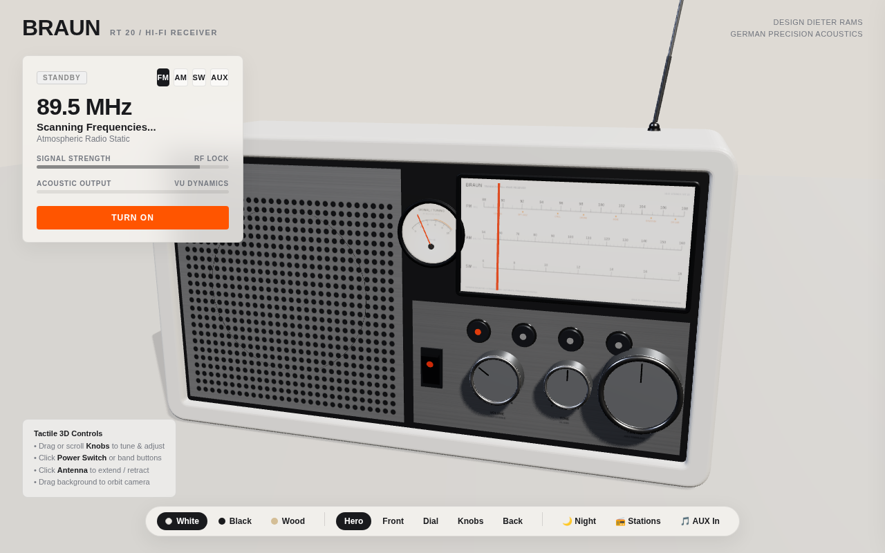

# BRAUN RT 20 — 3D Interactive Radio Receiver

An interactive, high-fidelity 3D web radio player built with **Three.js** and the **Web Audio API**, paying homage to **Dieter Rams** and the iconic Ulm School / Braun design philosophy (*"Weniger, aber besser"* / *"Less, but better"*).



---

## ✨ Features & Craftsmanship

### 1. Authentic Industrial Design (Homage to Dieter Rams)
- **Three Iconic Braun Themes**:
  - **Atelier White**: Warm matte off-white casing, brushed anodized aluminum faceplate, and signature cadmium-orange accents.
  - **Atelier Anthracite**: Deep matte black casing with gunmetal aluminum panels.
  - **RT 20 Wood & White**: 1961 classic featuring blonde Scandinavian ash wooden side cheeks.
- **Physical Details**:
  - **Perforated Speaker Grille**: Full-coverage micro-perforations with dark acoustic backing and the vintage *BRAUN* logo.
  - **Dynamic Speaker Cone**: 3D paper cone and dust cap that physically vibrate to the bass frequencies of the music in real time.
  - **Illuminated Dial Window**: Backlit frosted frequency scale with hairline cadmium-orange tuning pointer.
  - **Analog Signal / VU Meter**: Functional galvanometer needle that deflects realistically with spring damping to signal strength and audio levels.
  - **Knurled Aluminum Knobs**: Tactile fluted cylindrical dials with polished chamfered rims and dark hairline pointers.
  - **Tactile Controls**: Depressible waveband pushbuttons (`FM`, `AM`, `SW`, `AUX`), power rocker switch with orange dot, and a 4-stage telescopic chrome antenna.
  - **Back Panel**: Perforated heat ventilation slots, serial number, and vintage German specification plate.

---

### 2. Physical & Tactile 3D Interaction
- **Interactive Knobs**: Click and drag horizontally/vertically or use the mouse wheel to smoothly twist the **Tuning**, **Volume**, and **Tone (Klang)** knobs.
- **Auditory Feedback**: Mechanical clicks on button presses, low-frequency transformer "thump" on power-on, and detent ratchet ticks when spinning knobs.
- **Telescopic Antenna**: Click the antenna to extend or retract it; collapsing the antenna adds realistic atmospheric noise and decreases signal reception.
- **Camera Presets**: Smooth interpolated camera navigation between **Hero (3/4)**, **Front**, **Dial Close-up**, **Knobs**, and **Back**.
- **Studio Day & Twilight Night Modes**: In Night Mode, ambient room light dims into a cozy twilight, and the warm incandescent dial lamp casts a warm amber glow across the faceplate.

---

### 3. Real 24/7 Chill & Downtempo Live Stations (Full CORS)
- **★ Dedicated Chill & Downtempo FM Lineup**:
  - `89.5 MHz`: **SomaFM Groove Salad** — The legendary ambient/downtempo beats channel
  - `91.5 MHz`: **SomaFM Lush** — Sensuous, mellow vocal chillout & downtempo
  - `93.5 MHz`: **SomaFM Fluid** — Soulful chill hip-hop, future soul & lofi beats
  - `95.7 MHz`: **SomaFM Ill Street Lounge** — Classic bachelor pad exotica & vintage lounge
  - `98.3 MHz`: **SomaFM Drone Zone** — Deep atmospheric space ambient chill
  - `100.8 MHz`: **SomaFM Suburbs of Goa** — Asian ambient chill & world beats
  - `103.2 MHz`: **SomaFM Vaporwaves** — Dreamy vaporwave, chillwave & nostalgic synth
  - `105.5 MHz`: **SomaFM Deep Space One** — Deep space ambient electronic chill
  - `107.5 MHz`: **SomaFM Beat Blender** — Late-night deep chill house & grooves
- **★ Vintage Lounge & Jazz AM Band**:
  - `600 kHz`: **SomaFM Secret Agent** — 1960s spy jazz, film noir & surf lounge
  - `820 kHz`: **SomaFM Boot Liquor** — Vintage Americana, roots & acoustic chill
  - `1050 kHz`: **SomaFM Folk Forward** — Indie & traditional acoustic folk chill
  - `1340 kHz`: **SomaFM Groove Salad Classic** — Heritage early 2000s downtempo chill
- **★ Atmospheric Shortwave Band**:
  - `7.25 MHz`: **SomaFM Mission Control** — Space ambient mixed with live NASA astronaut audio
  - `9.49 MHz`: **SomaFM SF 10-33** — Ambient space mixed with live scanner radio
  - `11.85 MHz`: **SomaFM DEF CON Radio** — Dark ambient & cyber electronic
  - `14.20 MHz`: **SomaFM Synphaera** — Modern space ambient synthscapes
- **Realistic Tuning & Static Mechanics**:
  - Continuous pink/white noise passed through a resonant bandpass filter tracking the dial position.
  - Superheterodyne heterodyne whistle sweeps in pitch toward zero-beat as the dial approaches a carrier wave.
  - Automatic Gain Control (AGC): Static volume drops as you lock onto a strong station.
- **Procedural Synthesizer Fallback**:
  - Generates warm ambient chords and analog tone sweeps even if offline without internet access.
- **AUX / Line-In Mode**:
  - Drag and drop your own MP3/WAV/FLAC audio files onto the radio to play custom music through the vintage speaker!

---

## 🚀 Getting Started

### Development Server
```bash
npm run dev
```
Open [http://localhost:5173](http://localhost:5173) in your browser.

### Build Production Bundle
```bash
npm run build
npm run preview
```

### Deep-Link Query Parameters
You can initialize the radio in custom views and states directly via URL parameters:
- `?theme=wood` / `?theme=black` / `?theme=white`
- `?view=dial` / `?view=controls` / `?view=front` / `?view=hero` / `?view=back`
- `?night=true` (Twilight studio lighting with dial lamp illuminated)
- `?power=on` (Immediately turn on power)

Examples:
- [http://localhost:5173/?view=dial&power=on&night=true](http://localhost:5173/?view=dial&power=on&night=true) (Night close-up of dial)
- [http://localhost:5173/?theme=wood&power=on](http://localhost:5173/?theme=wood&power=on) (RT 20 Wood edition powered on)

---

## 🛠️ Architecture

- `src/radioModel.js`: 3D procedural construction of the Braun radio (cabinet, bezel, speaker cone, dial window, needle, VU meter, knobs, switches, antenna).
- `src/textures.js`: High-resolution canvas texture generators for dial scales, speaker perforations, brushed aluminum, knurl normal maps, and DIN spec plates.
- `src/audioEngine.js`: Web Audio API graph (live streams, procedural static & heterodyne oscillators, band filters, tone controls, and dynamic visualizer analyser).
- `src/interaction.js`: 3D raycasting, knob dragging, scroll-wheel tuning, tactile button clicks, and tooltips.
- `src/main.js`: Three.js scene setup, PBR lighting, camera preset interpolations, and UI synchronization.
- `src/style.css`: Minimalist Bauhaus/Ulm school typography and floating frosted glass interface.
